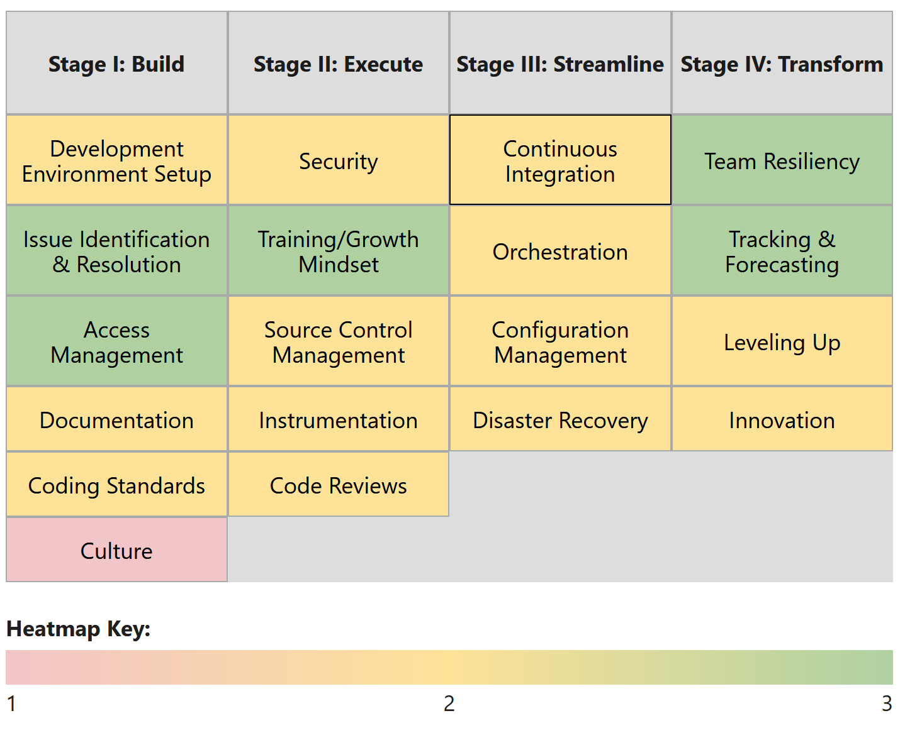
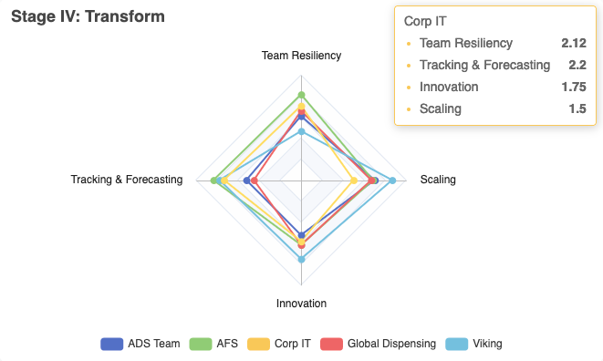

# Accelerate SDLC {.r-fit-text .original data-background-image="images/iStock-1377749663.jpg"}
## Introducing The BEST™ Framework
#### Calvin Hendryx-Parker, CTO
#### Six Feet Up
#### IT Leaders Indianapolis 2023

::: notes
- Nowadays, the world runs on software
- If you want to impact the world, you will want to be as productive as possible
- quick intro
:::

---

<iframe src="https://wall.sli.do/event/rcWdQQHxXXLM5BTBPpFwAr" class="stretch"></iframe>

::: notes
1. Team Survey
2. Velocity Happiness
3. Initial thoughts on lack of velocity
:::

# Journey {data-background-image="images/space_journey.png"}

* True Story

::: notes
engaged 6 teams to interview a subset of people from each team
80 hours of work for the 6 teams
:::

# Incorrect Assumptions {data-background-image="images/space_paradox.png"}

__example heatmaps here__

# Unearth The Source Of Inefficiency {.r-fit-text .original data-background-image="images/iStock-1358839342.jpg"}

- Accelerate delivery velocity
- Help management identify issues

::: notes
- How do you know if you could accelerate your delivery velocity?
- There could be a wide variety of issues at play
    - Examples include (mention 3-4): 
        - Delays in approval 
        - Inadequate communication
        - Insufficient testing 
        - Incomplete code 
        - Conflicts 
        - Security concerns 
        - Insufficient resources
        - Changes in priorities
        - Third-party tool dependency
        - Lack of goals 
        - Turnover
        - Ineffective monitoring 
        - Inefficient development 
        - Difficulty integrating software components 
- How do you help your management team see and care about those issues?
:::

# Gain A Strategic Advantage {.r-fit-text .original data-background-image="images/iStock-672950640.jpg"}

- 4 Stages 
- 19 Units
- Team reports, not individual results

::: notes
- Individual answers are not reported back to management; only team ratings are
:::

# Where to start? {.r-fit-text data-background-image="images/space_building.png"}

sample image of our stages

# How'd it go? {data-background-image="images/space_tribunal.png"}

::: notes
- Interviews are time-consuming and biased:
    - not everybody was invited
    - not everybody who was invited spoke their minds
    - a survey would be much better
        - make sure it aggregates results at the team level, not the individual level
:::

# Data-Driven Insights {.r-fit-text data-background-image="images/space_analytics.png"}

 

::: notes
- Team Report Heatmaps highlight areas that require attention
- You get practical recommendations on 90 datapoints
- For organizations with more than one dev teams, BEST will generate Performance Radar Maps that identify the top performing teams and empower your best developers to share their effective processes and knowledge.
- This gives you all great insights when talking to your bosses about improving things in your teams
:::
 
# Recommendations {data-background-image="images/space_admiral.png"}

- List your best SDLC practices
- Order them according to priority
- Develop questions with only 3 options (for ease of scoring)
- Have everyone take the survey
- Identify your internal domains of expertise and leverage them
- Repeat every 6 months and monitor progress

::: notes
- Engage the audience: Show QR code to a PDF of our 4 stages and 19 units w contact info
:::

# Get in touch {.original data-background-image="images/iStock-1377749663.jpg"}

 
