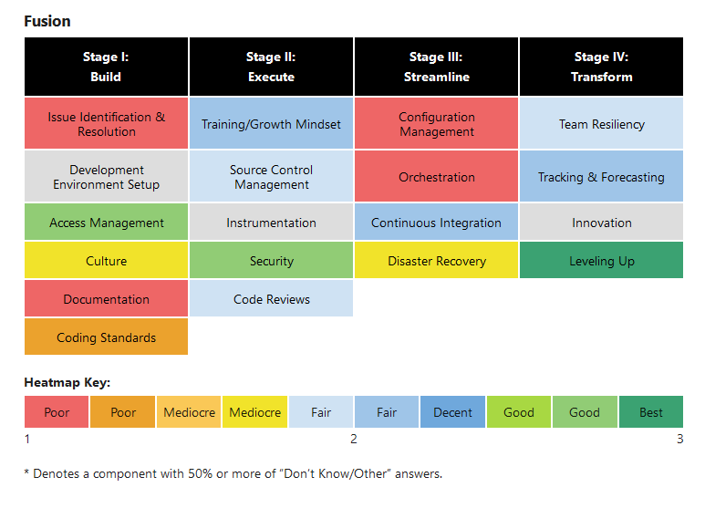
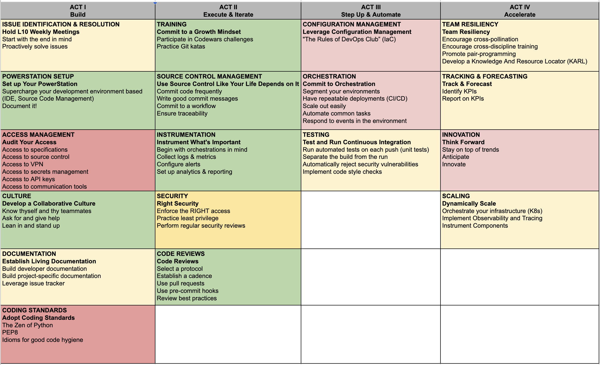
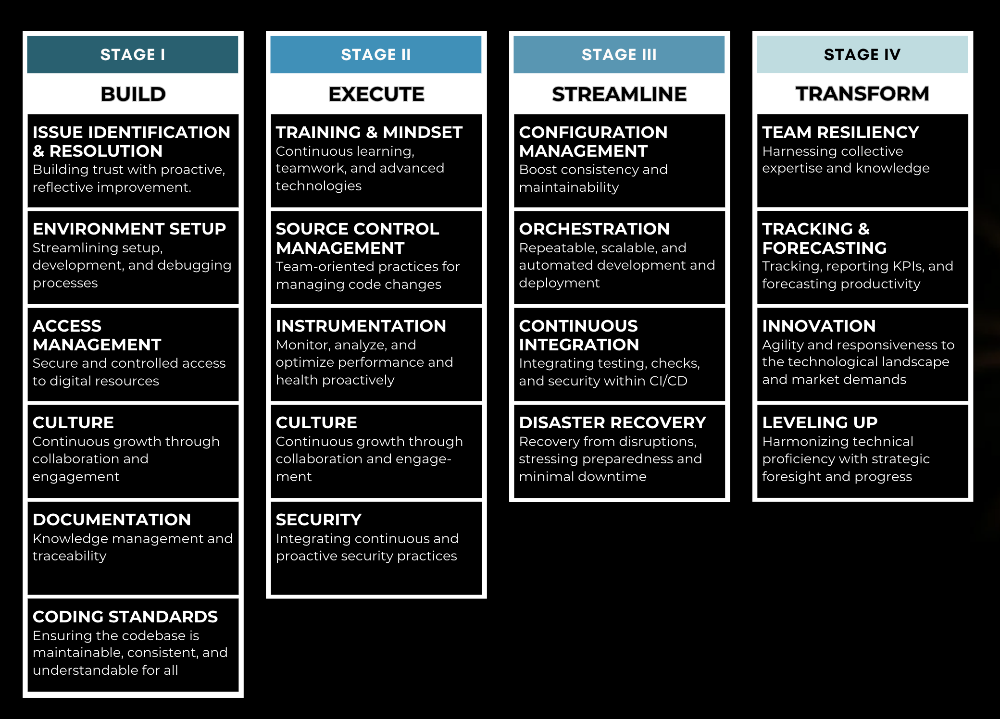
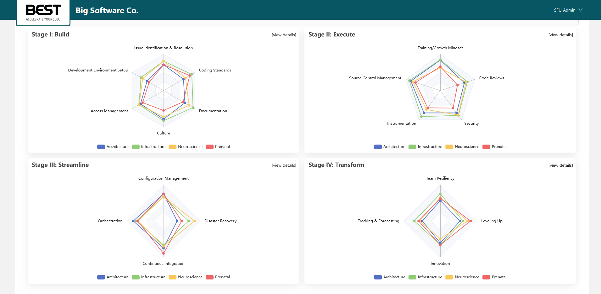
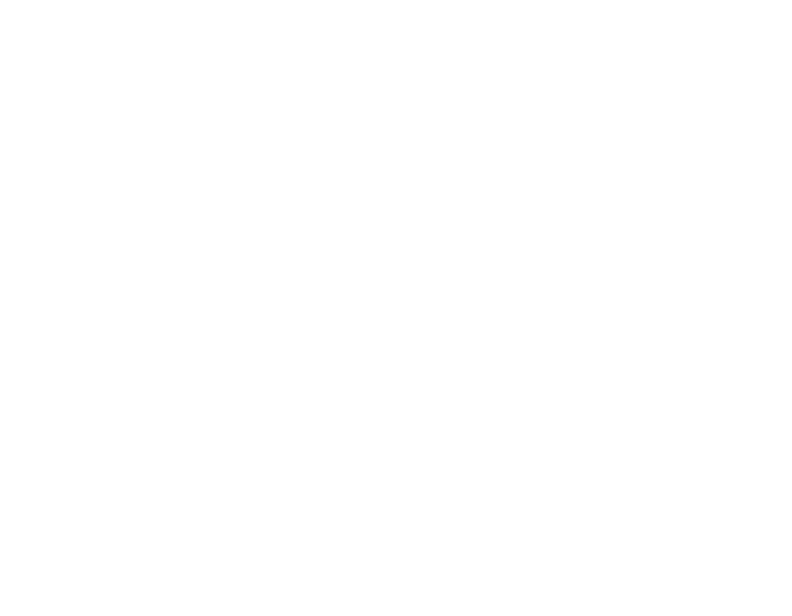

# Accelerate your SDLC {.r-fit-text .original data-background-image="images/iStock-1377749663.jpg"}
## Introducing The BEST™ Framework
#### Calvin Hendryx-Parker, CTO
#### Six Feet Up
#### Good Tech Fest -- Lunch & Learn 2024

::: notes
- Nowadays, the world runs on software
 
Stats from Worldmetrics, Shocking Project Failure Statistics: Majority of IT Projects at Risk, July 23, 2024.
75% of business and IT executives anticipate their software projects will fail. The failure rate of IT projects is 43%.
Two-thirds of software projects fail due to cost overruns or delays

- If you want to impact the world, you will want to be as productive as possible

Six Feet Up is the premier Python and AI agency in the US that specializes in solving hard problems. 

More experience per capita than any other agency

25 years of experience across 12+ industries

Hybrid project management approach
:::

# Source Slides/Presentation

---

<iframe src="https://wall.sli.do/event/675UfJCJWPvX12Fq46WqvB" class="stretch"></iframe>

::: notes
1. Team Survey
2. Velocity Happiness
:::

# Journey {data-background-image="images/space_journey.png"}

## "How can we be more like you?" {.r-fit-text}

* 6 Globally Distributed Teams
* Some Poorly Performing
* Goal to Improve Delivery Velocity
 
::: notes
engaged 6 teams to interview a subset of people from each team
80 hours of work for the 6 teams
 
* Assumptions:
  * Poor Test Coverage?
  * Technical Debt?

:::

---

<iframe src="https://wall.sli.do/event/675UfJCJWPvX12Fq46WqvB" class="stretch"></iframe>

::: notes
1. Initial thoughts on lack of velocity
:::

# Discovery of Root Causes {data-background-image="images/space_discovery.png"}

### Inefficient Processes and Bottlenecks?

### Technical Debt and Complex Codebases?

### Team Skill Gaps and Collaboration Issues?

* Interviewed 6 Teams
* Used a sampling of people
* About 6 hours per team in just interviews
* Uncovered many more issues

::: notes
Out of over 30 teams
Using our own internal knowledge as a guide

Legacy workflows, unclear requirements, and manual interventions in CI/CD pipelines can slow down development. Removing these inefficiencies and adopting modern tools or automation requires significant effort.

Accumulated technical debt and overly complex or outdated codebases make it harder for teams to deliver quickly. Refactoring or optimizing this code demands time and resources, which slows down immediate velocity improvements.

Teams may lack the necessary skills or training to adopt new tools, frameworks, or methodologies. Poor communication and misalignment between development, QA, and operations can further hamper speed.
:::

# One Team, Many Issues {data-background-image="images/space_paradox.png"}

# Prioritizing Investments {data-background-image="images/space_paradox.png"}

* 4 Stages, 19 Units, 90 Datapoints

::: notes
Each stage builds upon another
- Build
- Execute
- Streamline
- Transform
 
choose to focus on top 3
best to know the business
:::

# Tale of Two Teams {data-background-image="images/space_paradox.png"}

- Leverage Cross-Team Pollination

::: notes
We discovered that there were more issues to blame
But there were some teams with strong practices
The story of Pete and Andy
:::

# Where to start? {.r-fit-text data-background-image="images/space_building.png"}

- Rely on surveys, not interviews
- Aggregate results at the team level
- Identify areas of synergy

::: notes
- Interviews are time-consuming and biased:
  - not everybody was invited
  - not everybody who was invited spoke their minds
  - a survey would be much better
    - make sure it aggregates results at the team level, not the individual level
:::

# DIY Assessments {data-background-image="images/space_diy.png"}

- Identify your best SDLC practices
- Order them according to priority
- Develop questions with only 3 options (for ease of scoring)
- Have everyone take the survey
- Identify your internal domains of expertise and leverage them
- Repeat every 6 months and monitor progress

::: notes
- Engage the audience: Show QR code to a PDF of our 4 stages and 19 units w contact info
:::

# Download our 19 BEST™ Practice Areas {.r-fit-text}

::: notes
4 stages, 19 units, 90 questions
Note to crowd, we are continuously evolving these each time we use these tools
:::

# Data-Driven Insights {data-background-image="images/space_analytics.png"}

::: notes
- Team Report Heatmaps highlight areas that require attention
- You get practical recommendations on 90 datapoints
- For organizations with more than one dev teams, BEST will generate Performance Radar Maps that identify the top performing teams and empower your best developers to share their effective processes and knowledge.
- This gives you all great insights when talking to your bosses about improving things in your teams
:::
 
---

<iframe src="https://wall.sli.do/event/675UfJCJWPvX12Fq46WqvB" class="stretch"></iframe>

# Explore Further... {.original data-background-image="images/iStock-1377749663.jpg"}

 

# Talk To Me {data-background-image="images/space_comms.png"}

📩 <calvin@sixfeetup.com>  
🤝 <https://linkedin.com/in/calvinhp>  
✖️ [@calvinhp](https://x.com/calvinhp)  
🐘 [@calvinhp@fosstodon.org](https://fosstodon.org/@calvinhp)  
